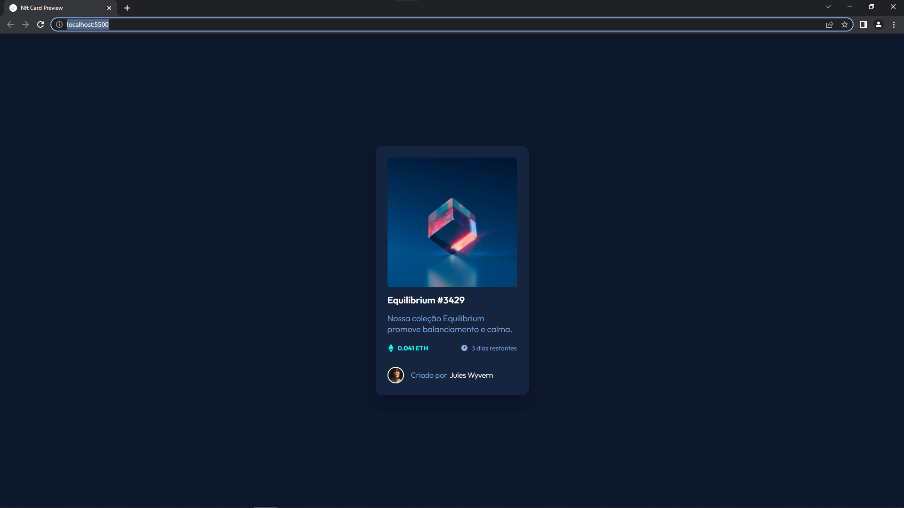

# Frontend Mentor - Solução do componente cartão de visualização NFT

Essa é a minha solução para [NFT preview card component challenge on Frontend Mentor](https://www.frontendmentor.io/challenges/nft-preview-card-component-SbdUL_w0U).

## Índice

- [Visão Geral](#visão-geral)
  - [O desafio](#o-desafio)
  - [Screenshot](#screenshot)
  - [Links](#links)
- [Meu processo](#meu-processo)
  - [O que eu aprendi](#o-que-eu-aprendi)
- [Autor](#autor)
- [Agradecimentos](#agradecimentos)

## Visão geral

### O desafio

O usuário deve saber:

- Visualizar o melhor layout dependendo do tamanho de tela do dispositivo
- Ver os estados de hover dos elementos interativos

### Screenshot




### Links

- Solução URL: [Repositório GitHub](https://github.com/Leandro-Sousa-dev/NFT-Card)
- Página da solução URL: [GitHub Pages](https://leandro-sousa-dev.github.io/NFT-Card/)

## Meu processo
- Meu metodo foi olhar e tentar desvendar os elementos utilizados
- Foi Utilizado HTML e CSS Para concluir o desafio.

### O que eu aprendi
- Nesse projeto aprendi a utilizar de melhor forma os pseudo-elementos before e after,  tendo assim mais opções de estilização de elementos.


```css
.nft-card .principal .image-link::after{
    content: '';
    background: url(/src/images/icon-view.svg) no-repeat center;
    width: 100%;
    height: 100%;
    position: absolute;
    opacity: 0;
    transition: 0.3s ease-in-out;
}

.nft-card .infos .preco::before{
    content: url(/src/images/icon-ethereum.svg);
    margin-right: 7px;
}
```


## Autor

- GitHub - [Meu GitHub Para mais projetos](https://github.com/Leandro-Sousa-dev)
- Frontend Mentor - [@Leandro-Sousa-dev](https://www.frontendmentor.io/profile/Leandro-Sousa-dev)
- Twitter - [@Leandro_dev_](https://twitter.com/Leandro_dev_)


## Agradecimentos

- Dev Em Dobro - [Instagram](https://www.instagram.com/devemdobro/)